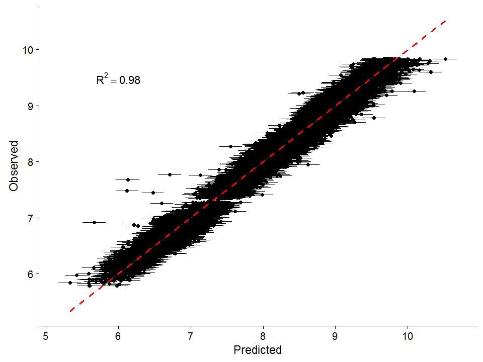

#### Keywords: Bayesian, brms, looic, model selection, multiple regression, posterior probability check, weighted model averaging


## Introduction

There are many [good reasons](http://andrewgelman.com/2016/12/13/bayesian-statistics-whats/ "good reasons") to analyse your data using Bayesian methods.Historically, however, these methods have been computationally intensive and difficult to implement, requiring knowledge of sometimes challenging coding platforms and languages, like [WinBUGS](https://www.mrc-bsu.cam.ac.uk/software/bugs/the-bugs-project-winbugs/ "WinBUGS"), [JAGS](http://mcmc-jags.sourceforge.net/ "JAGS"), or [Stan](http://mc-stan.org/ "Stan"). Newer R packages, however, including, [r2jags](https://cran.r-project.org/web/packages/R2jags/index.html "r2jags"), [rstanarm](https://cran.r-project.org/web/packages/rstanarm/index.html "rstanarm"), and [brms](https://cran.r-project.org/web/packages/brms/index.html "brms") have made building Bayesian regression models in R relatively [straightforward](https://thinkinator.com/2016/01/12/r-users-will-now-inevitably-become-bayesians/ "straightforward"). For some background on Bayesian statistics, there is a Powerpoint presentation [here](https://www.k-state.edu/cnap/Bayesian%20statistics%20powerpoint.pptx "here").

Here I will introduce code to run some simple regression models using the brms package. This package offers a little more flexibility than rstanarm, although the both offer many of the same functionality. I encourage you to check out the extremely helpful [vignettes](https://github.com/paul-buerkner/brms/tree/master/vignettes "vignettes") written by Paul Buerkner. Paul's [Github](https://github.com/paul-buerkner/brms "Github") page is also a useful resource. I won't go into too much detail on prior selection, or demonstrating the full flexibility of the brms package (for that, check out the vignettes), but I will try to add useful links where possible. I will also go a bit beyond the models themselves to talk about model selection using loo, and model averaging


## Packages
First, lets load the packages, the most important being brms.


```r
require(brms)
require(ggplot2)
require(gdata)
require(dplyr)
require(parallel)
require(cowplot)
```

## The Data
For this analysis, I am going to use the diamonds dataset, from ggplot2. Because it is pretty large, I am going to subset it.


```r
set.seed(2018)
data(diamonds)

diamonds.full <- na.omit(diamonds) %>% drop.levels # remove missing data

diamonds.full$rows <- as.numeric(rownames(diamonds.full))

diamonds.train <- diamonds.full %>% group_by(color, clarity) %>% sample_n(size = 30) # subset
  
diamonds.keep <-   filter(diamonds.full, !rows %in% diamonds.train$rows) # remove row in training set

diamonds.test <- diamonds.keep[sample(nrow(diamonds.keep), 20000), ]

# get rid of zero values and outliers

diamonds.train <- diamonds.train %>% filter( x> 0, y >0, z > 0, price > 0, price < max(diamonds$price))

diamonds.test <- diamonds.test %>% filter( x> 0, y >0, z > 0, price > 0, price < max(diamonds$price))

```

## Setting the number of cores
Because these analyses can sometimes be a little sluggish, it is recommended to set the number of cores you use to the maximum number available. You can check how many cores you have available with the following code. 


```r
getOption("mc.cores", 1)
## [1] 2
```

We'll use this bit of code again when we are running our models and doing model selection.

## Examining and visualizing data
What I am interested in is how well the properties of a diamond predict it's price. Does the size of the diamond matter? What is the relative importance of color vs clarity?  Given that the answer to both of these questions is almost certainly yes, let's see if the models tell us the same thing. To get a description of the data, let's use the help function.


```r
help(diamonds)
```


Let's take a look at the data. First let's plot price as a function carat, a well-know metric of diamond quality. Here I plot the raw data and then both variables log-transformed.


```r

plot_grid(
  ggplot()+
    
    geom_point(data = diamonds.train, aes(y = price, x = carat))+
    
    geom_smooth(), 

  ggplot()+
    
    geom_point(data = diamonds.train, aes(y = log(price), x = log(carat)))+
    
    geom_smooth(), ncol = 2

  )
```

<!-- -->

We might considering logging price before running our models with a Gaussian family, or consider using a different link function (e.g. log). First, let's visualize how clarity and color influence price. Here I will first plot boxplots of price by level for clarity and color, and then price vs carat, with colors representing levels of clarity and color.


```r

plot_grid(
  
  ggplot(data = diamonds.train, aes(y = log(price), x = clarity)) + geom_boxplot(), 
  
  ggplot(data = diamonds.train, aes(y = log(price), x = color)) + geom_boxplot(), 
  
  ggplot(data = diamonds.train, aes(y = log(price), x = log(carat), color = clarity)) + 
    
         geom_point() + geom_smooth(method = "lm") + 
         
         ylim(c(min(log(diamonds$price)),  max(log(diamonds$price)))), 
  
  ggplot(data = diamonds.train, aes(y = log(price), x = log(carat), color = color)) + 
         
         geom_point() + geom_smooth(method = "lm") + 
    
         ylim(c(min(log(diamonds$price)), max(log(diamonds$price)))), 

  ncol = 2
)
```

<!-- -->

From these plots, it looks as if there may be differences in the intercepts and slopes (especially for clarity) between color and clarity classes. We can model this using a mixed effects model. But let's start with simple multiple regression.

## Fitting models
For this first model, we will look at how well diamond 'carat' correlates with price. 


```r
brm.1 <- brm(log(price) ~ log(carat), 
             
             brmsfamily("gaussian"), 
     
             data = na.omit(diamonds.train), 
             
             chains = 4, #specify the number of Markov chains
             
             cores = getOption("mc.cores", 1),
             
             iter = 3000, warmup = 1500, thin = 5,
             
             prior =  c(prior(normal(0, 3), "b"), # set normal prior on regression coefficients (mean of 0, location of 3)
                        
                        prior(normal(0, 3), "Intercept"))) # set normal prior on intercept (mean of 0, location of 3)
```

This might take a few minutes to run, depending on the speed of your machine.

A really fantastic tool for interrogating your model is using the 'launch_shinystan' function, which you can call as: 

'launch_shinystan(brm.1)'.

For now, we will take a look at a summary of the models in R, as well as plots of the posterior distributions and the Markov chains. We can see from the summary that our chains have converged sufficiently (rhat = 1).

We can also get an R-squared estimate for our model, thanks to a newly-developed method from Andrew Gelman, Ben Goodrich, Jonah Gabry and Imad Ali, with an explanation [here](http://www.stat.columbia.edu/~gelman/research/unpublished/bayes_R2.pdf "here").


```r
summary(brm.1) # note Population-Level Effects = 'fixed effects'
##  Family: gaussian 
##   Links: mu = identity; sigma = identity 
## Formula: log(price) ~ log(carat) 
##    Data: na.omit(diamonds.train) (Number of observations: 1680) 
## Samples: 4 chains, each with iter = 3000; warmup = 1500; thin = 5;
##          total post-warmup samples = 1200
## 
## Population-Level Effects: 
##           Estimate Est.Error l-95% CI u-95% CI Eff.Sample Rhat
## Intercept     8.35      0.01     8.32     8.37       1196 1.00
## logcarat      1.51      0.01     1.49     1.54       1151 1.00
## 
## Family Specific Parameters: 
##       Estimate Est.Error l-95% CI u-95% CI Eff.Sample Rhat
## sigma     0.36      0.01     0.35     0.37       1200 1.00
## 
## Samples were drawn using sampling(NUTS). For each parameter, Eff.Sample 
## is a crude measure of effective sample size, and Rhat is the potential 
## scale reduction factor on split chains (at convergence, Rhat = 1).

plot(brm.1)
```

<!-- -->

```r

stanplot(brm.1, pars = c("b_Intercept", "b_logcarat")) + xlim(c(0, 9))
```

<!-- -->

```r

bayes_R2(brm.1)
##     Estimate   Est.Error      Q2.5     Q97.5
## R2 0.8764618 0.001968945 0.8722297 0.8800917
```

Note that log(carat) clearly explains a lot of the variation in diamond price (as we'd expect), with a significantly positive slope (1.52 +- 0.01).


## Model validation using approximate leave-one-out cross-validation
Another way to get at the model fit is approximate leave-one-out cross-validation, via the [loo](http://mc-stan.org/loo/reference/loo-package.html "loo") package, developed by Vehtari, Gelman, and Gabry ( [2017a](https://link.springer.com/article/10.1007%2Fs11222-016-9696-4 "2017a"), [2017b](https://arxiv.org/abs/1507.02646 "2017b") ). Using loo, we can compute a LOOIC, which is similar to an [AIC](https://en.wikipedia.org/wiki/Akaike_information_criterion "AIC"), which some readers may be familiar with. 


```r
loo(brm.1, cores = getOption("mc.cores", 1))
## 
## Computed from 1200 by 1680 log-likelihood matrix
## 
##          Estimate   SE
## elpd_loo   -668.9 36.6
## p_loo         3.8  0.3
## looic      1337.8 73.3
## ------
## Monte Carlo SE of elpd_loo is 0.1.
## 
## All Pareto k estimates are good (k < 0.5).
## See help('pareto-k-diagnostic') for details.
plot(loo(brm.1, cores = getOption("mc.cores", 1)))
```

<!-- -->

The plot of the loo shows the Pareto shape k parameter for each data point. This parameter is used to test the reliability and convergence rate of the PSIS-based estimates. For more details, check out the help and the references above. For our purporses, we want to ensure that no data points have too high values of this parameter. The default threshold for a high value is k > 0.7.

## Mixed effects models
We can also run models including group-level effects (also called random effects). Here I will run models with clarity and color as grouping levels, first separately and then together in an 'overall' model.

Here's the model with clarity as the group-level effect. I have also run the function 'loo', so that we can compare models. The model with the lowest LOOIC is the better model. 


```r
brm.2 <- brm(log(price) ~ log(carat) + (1|clarity), 
             
             brmsfamily("gaussian"), 
     
             data = na.omit(diamonds.train), 
             
             chains = 4, #specify the number of Markov chains
             
             cores = getOption("mc.cores", 1),
             
             iter = 3000, warmup = 1500, thin = 5,
             
             prior =  c(prior(normal(0, 3), "b"), # set normal prior on regression coefficients (mean of 0, location of 3)
                        
                        prior(normal(0, 3), "Intercept"))) # set normal prior on intercept (mean of 0, location of 3)

loo(brm.1, brm.2)
##                 LOOIC    SE
## brm.1         1337.85 73.28
## brm.2           38.45 66.18
## brm.1 - brm.2 1299.40 52.07
```

And now with color.


```r
brm.3 <- brm(log(price) ~ log(carat)  + (1|color), 
             
             brmsfamily("gaussian"), 
     
             data = na.omit(diamonds.train), 
             
             chains = 4, #specify the number of Markov chains
             
             cores = getOption("mc.cores", 1),
             
             iter = 3000, warmup = 1500, thin = 5,
             
             prior =  c(prior(normal(0, 3), "b"), # set normal prior on regression coefficients (mean of 0, location of 3)
                        
                        prior(normal(0, 3), "Intercept"))) # set normal prior on intercept (mean of 0, location of 3)

loo(brm.1, brm.2, brm.3)
##                  LOOIC    SE
## brm.1          1337.85 73.28
## brm.2            38.45 66.18
## brm.3          1074.62 68.59
## brm.1 - brm.2  1299.40 52.07
## brm.1 - brm.3   263.23 30.99
## brm.2 - brm.3 -1036.17 64.23
```


And here's a model with the log of carat as the fixed effect and color and clarity as group-level effects.


```r
brm.4 <- brm(log(price) ~ log(carat) + (1|color) + (1|clarity), 
             
             brmsfamily("gaussian"), 
     
             data = na.omit(diamonds.train), 
             
             chains = 4, #specify the number of Markov chains
             
             cores = getOption("mc.cores", 1),
             
             iter = 3000, warmup = 1500, thin = 5,
             
             prior =  c(prior(normal(0, 3), "b"), # set normal prior on regression coefficients (mean of 0, location of 3)
                        
                        prior(normal(0, 3), "Intercept"))) # set normal prior on intercept (mean of 0, location of 3)

loo(brm.1, brm.2, brm.3, brm.4)
##                  LOOIC    SE
## brm.1          1337.85 73.28
## brm.2            38.45 66.18
## brm.3          1074.62 68.59
## brm.4         -1342.73 71.67
## brm.1 - brm.2  1299.40 52.07
## brm.1 - brm.3   263.23 30.99
## brm.1 - brm.4  2680.58 67.48
## brm.2 - brm.3 -1036.17 64.23
## brm.2 - brm.4  1381.18 62.57
## brm.3 - brm.4  2417.35 63.27

bayes_R2(brm.4)
##     Estimate    Est.Error     Q2.5     Q97.5
## R2 0.9750782 0.0002039838 0.974631 0.9754266

summary(brm.4)
##  Family: gaussian 
##   Links: mu = identity; sigma = identity 
## Formula: log(price) ~ log(carat) + (1 | color) + (1 | clarity) 
##    Data: na.omit(diamonds.train) (Number of observations: 1680) 
## Samples: 4 chains, each with iter = 3000; warmup = 1500; thin = 5;
##          total post-warmup samples = 1200
## 
## Group-Level Effects: 
## ~clarity (Number of levels: 8) 
##               Estimate Est.Error l-95% CI u-95% CI Eff.Sample Rhat
## sd(Intercept)     0.45      0.16     0.25     0.83        965 1.00
## 
## ~color (Number of levels: 7) 
##               Estimate Est.Error l-95% CI u-95% CI Eff.Sample Rhat
## sd(Intercept)     0.26      0.11     0.14     0.55       1044 1.00
## 
## Population-Level Effects: 
##           Estimate Est.Error l-95% CI u-95% CI Eff.Sample Rhat
## Intercept     8.45      0.20     8.03     8.83        982 1.00
## logcarat      1.86      0.01     1.84     1.87       1200 1.00
## 
## Family Specific Parameters: 
##       Estimate Est.Error l-95% CI u-95% CI Eff.Sample Rhat
## sigma     0.16      0.00     0.16     0.17       1200 1.00
## 
## Samples were drawn using sampling(NUTS). For each parameter, Eff.Sample 
## is a crude measure of effective sample size, and Rhat is the potential 
## scale reduction factor on split chains (at convergence, Rhat = 1).
coef(brm.4)
## $clarity
## , , Intercept
## 
##      Estimate Est.Error     Q2.5    Q97.5
## I1   7.757952 0.1116812 7.534508 7.972229
## IF   8.896737 0.1113759 8.666471 9.119115
## SI1  8.364881 0.1118541 8.138917 8.585221
## SI2  8.208712 0.1116475 7.976549 8.424202
## VS1  8.564924 0.1114861 8.338425 8.780385
## VS2  8.500922 0.1119241 8.267040 8.715973
## VVS1 8.762394 0.1112272 8.528874 8.978609
## VVS2 8.691808 0.1113552 8.458141 8.909012
## 
## , , logcarat
## 
##      Estimate  Est.Error     Q2.5   Q97.5
## I1   1.857542 0.00766643 1.842588 1.87245
## IF   1.857542 0.00766643 1.842588 1.87245
## SI1  1.857542 0.00766643 1.842588 1.87245
## SI2  1.857542 0.00766643 1.842588 1.87245
## VS1  1.857542 0.00766643 1.842588 1.87245
## VS2  1.857542 0.00766643 1.842588 1.87245
## VVS1 1.857542 0.00766643 1.842588 1.87245
## VVS2 1.857542 0.00766643 1.842588 1.87245
## 
## 
## $color
## , , Intercept
## 
##   Estimate Est.Error     Q2.5    Q97.5
## D 8.717499 0.1646875 8.379620 9.044789
## E 8.628844 0.1640905 8.294615 8.957632
## F 8.569998 0.1645341 8.235241 8.891485
## G 8.489433 0.1644847 8.155874 8.814277
## H 8.414576 0.1642564 8.081458 8.739100
## I 8.273718 0.1639215 7.940648 8.590550
## J 8.123996 0.1638187 7.791308 8.444856
## 
## , , logcarat
## 
##   Estimate  Est.Error     Q2.5   Q97.5
## D 1.857542 0.00766643 1.842588 1.87245
## E 1.857542 0.00766643 1.842588 1.87245
## F 1.857542 0.00766643 1.842588 1.87245
## G 1.857542 0.00766643 1.842588 1.87245
## H 1.857542 0.00766643 1.842588 1.87245
## I 1.857542 0.00766643 1.842588 1.87245
## J 1.857542 0.00766643 1.842588 1.87245
```

All of the mixed effects models we have looked at so far have only allowed the intercepts of the groups to vary, but, as we saw when we were looking at the data, it seems as if different levels of our groups could have different slopes too. We can specify a model that allow the slope of the price~carat relationship to cary by both color and clarity.


```r
brm.5 <- brm(log(price) ~ log(carat)  + (1 + log(carat)|color) + (1 + log(carat)|clarity), 
             
             brmsfamily("gaussian"), 
     
             data = na.omit(diamonds.train), 
             
             chains = 4, #specify the number of Markov chains
             
             cores = getOption("mc.cores", 1),
             
             iter = 3000, warmup = 1500, thin = 5,
             
             prior =  c(prior(normal(0, 3), "b"), # set normal prior on regression coefficients (mean of 0, location of 3)
                        
                        prior(normal(0, 3), "Intercept"))) # set normal prior on intercept (mean of 0, location of 3)
```


We can now compare our models using 'loo'.


```r
loo(brm.1, brm.2, brm.3, brm.4, brm.5, cores = getOption("mc.cores", 1))
##                  LOOIC    SE
## brm.1          1337.85 73.28
## brm.2            38.45 66.18
## brm.3          1074.62 68.59
## brm.4         -1342.73 71.67
## brm.5         -1452.67 65.84
## brm.1 - brm.2  1299.40 52.07
## brm.1 - brm.3   263.23 30.99
## brm.1 - brm.4  2680.58 67.48
## brm.1 - brm.5  2790.51 67.56
## brm.2 - brm.3 -1036.17 64.23
## brm.2 - brm.4  1381.18 62.57
## brm.2 - brm.5  1491.12 62.75
## brm.3 - brm.4  2417.35 63.27
## brm.3 - brm.5  2527.29 63.79
## brm.4 - brm.5   109.94 33.21
```

It looks like the final model we ran is the best model. Let's take a look at the Bayesian R-squared value for this model, and take a look at the model summary. We can also get more details on the coefficients using the 'coef' function. Similarly we could use 'fixef' for population-level effects and 'ranef' from group-level effects. 


```r
bayes_R2(brm.4)
##     Estimate    Est.Error     Q2.5     Q97.5
## R2 0.9750782 0.0002039838 0.974631 0.9754266

summary(brm.4)
##  Family: gaussian 
##   Links: mu = identity; sigma = identity 
## Formula: log(price) ~ log(carat) + (1 | color) + (1 | clarity) 
##    Data: na.omit(diamonds.train) (Number of observations: 1680) 
## Samples: 4 chains, each with iter = 3000; warmup = 1500; thin = 5;
##          total post-warmup samples = 1200
## 
## Group-Level Effects: 
## ~clarity (Number of levels: 8) 
##               Estimate Est.Error l-95% CI u-95% CI Eff.Sample Rhat
## sd(Intercept)     0.45      0.16     0.25     0.83        965 1.00
## 
## ~color (Number of levels: 7) 
##               Estimate Est.Error l-95% CI u-95% CI Eff.Sample Rhat
## sd(Intercept)     0.26      0.11     0.14     0.55       1044 1.00
## 
## Population-Level Effects: 
##           Estimate Est.Error l-95% CI u-95% CI Eff.Sample Rhat
## Intercept     8.45      0.20     8.03     8.83        982 1.00
## logcarat      1.86      0.01     1.84     1.87       1200 1.00
## 
## Family Specific Parameters: 
##       Estimate Est.Error l-95% CI u-95% CI Eff.Sample Rhat
## sigma     0.16      0.00     0.16     0.17       1200 1.00
## 
## Samples were drawn using sampling(NUTS). For each parameter, Eff.Sample 
## is a crude measure of effective sample size, and Rhat is the potential 
## scale reduction factor on split chains (at convergence, Rhat = 1).

coef(brm.4)
## $clarity
## , , Intercept
## 
##      Estimate Est.Error     Q2.5    Q97.5
## I1   7.757952 0.1116812 7.534508 7.972229
## IF   8.896737 0.1113759 8.666471 9.119115
## SI1  8.364881 0.1118541 8.138917 8.585221
## SI2  8.208712 0.1116475 7.976549 8.424202
## VS1  8.564924 0.1114861 8.338425 8.780385
## VS2  8.500922 0.1119241 8.267040 8.715973
## VVS1 8.762394 0.1112272 8.528874 8.978609
## VVS2 8.691808 0.1113552 8.458141 8.909012
## 
## , , logcarat
## 
##      Estimate  Est.Error     Q2.5   Q97.5
## I1   1.857542 0.00766643 1.842588 1.87245
## IF   1.857542 0.00766643 1.842588 1.87245
## SI1  1.857542 0.00766643 1.842588 1.87245
## SI2  1.857542 0.00766643 1.842588 1.87245
## VS1  1.857542 0.00766643 1.842588 1.87245
## VS2  1.857542 0.00766643 1.842588 1.87245
## VVS1 1.857542 0.00766643 1.842588 1.87245
## VVS2 1.857542 0.00766643 1.842588 1.87245
## 
## 
## $color
## , , Intercept
## 
##   Estimate Est.Error     Q2.5    Q97.5
## D 8.717499 0.1646875 8.379620 9.044789
## E 8.628844 0.1640905 8.294615 8.957632
## F 8.569998 0.1645341 8.235241 8.891485
## G 8.489433 0.1644847 8.155874 8.814277
## H 8.414576 0.1642564 8.081458 8.739100
## I 8.273718 0.1639215 7.940648 8.590550
## J 8.123996 0.1638187 7.791308 8.444856
## 
## , , logcarat
## 
##   Estimate  Est.Error     Q2.5   Q97.5
## D 1.857542 0.00766643 1.842588 1.87245
## E 1.857542 0.00766643 1.842588 1.87245
## F 1.857542 0.00766643 1.842588 1.87245
## G 1.857542 0.00766643 1.842588 1.87245
## H 1.857542 0.00766643 1.842588 1.87245
## I 1.857542 0.00766643 1.842588 1.87245
## J 1.857542 0.00766643 1.842588 1.87245
```

Clearly, the variables we have included have a really strong influence on diamond price! 

## Posterior probability checking using pp_check
The [pp_check](https://cran.r-project.org/web/packages/bayesplot/vignettes/graphical-ppcs.html, "pp_check") allows for graphical posterior predictive checking. We can generate figures to compare the observed data to simulated data from the posterior predictive distribution. This is a great graphical way to evaluate your model. 

There are many different options of plots to choose from. In the first plot I use density plots, where the observed y values are plotted with expected values from the posterior distribution.


```r
pp_check(brm.5, nsamples = 100)
```

<!-- -->

It is good to see that our model is doing a fairly good job of capturing the slight bimodality in logged diamond prices, althogh specifying a different family of model might help to improve this.

Here, 'nsamples' refers to the number of draws from the posterior distribution to use to calculate yrep values. 

We can aslo look at the fit based on groups. Here, for example, are scatteplots with the observed prices (log scale) on the y-axis and the average (across all posterior samples) on the x-axis.


```r
pp_check(brm.5, type = "scatter_avg_grouped", group = "color") + 
  
  geom_abline(intercept = 0, slope = 1 , color = "red", lty = 2)
```

<!-- -->

## Model prediction
Finally, we can evaluate how well our model does at predicting diamond data that we held out. We can use the 'predict' function (as we would with a more standard model). We can also get estimates of error around each data point! We can plot the prediction using ggplot2.


```r

pred.1 <- predict(brm.5, newdata = diamonds.test)

r.sq <- as.character(round(summary(lm(log(diamonds.test$price) ~ pred.1[, 1]))$r.squared, 2))

lb1 <- paste("R^2 == ", r.sq)

ggplot()+
  
  geom_point(aes(x = pred.1[,1], y = log(diamonds.test$price))) +
  
  geom_errorbarh(aes(x = pred.1[,1], y = log(diamonds.test$price), 
                     
                     xmin = pred.1[,1] - pred.1[, 2], 
                     xmax = pred.1[,1] + pred.1[, 2])) + 
  
  geom_smooth(aes(x = pred.1[,1], y = log(diamonds.test$price)), method = "lm", color = "red", lty = 2)+
  
<<<<<<< HEAD
  geom_text(aes(x=6, y=9.5, label = lb1, size = 8), parse=TRUE, show.legend = F) +
  
  xlab("Predicted") +
  
  ylab("Observed")
=======
  geom_text(aes(x=6, y=9.5, label = lb1, size = 8), parse=TRUE, show.legend = F)
>>>>>>> 2179bdbd1c043d9e89637a40de70eac929e291f7
```

<!-- -->

That's all for this post.

Thanks for reading!

## Contact Me

Please check out my personal website at [timothyemoore.com](https://www.timothyemoore.com/ "timothyemoore.com")

